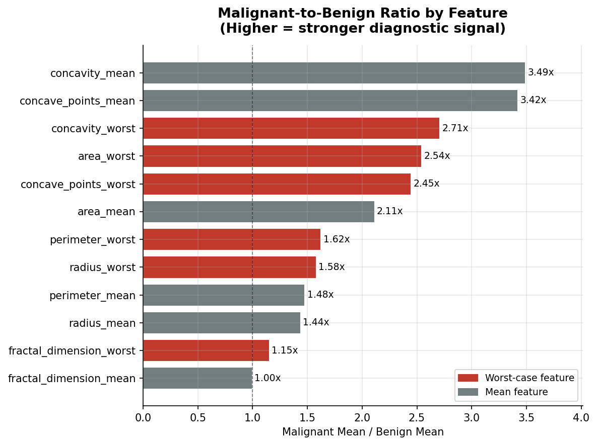
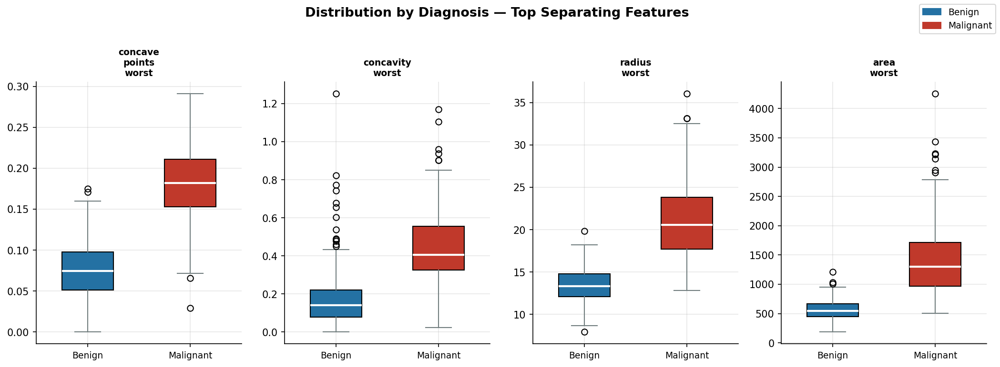

# Breast Cancer Diagnostic Analysis
**SQL-driven exploratory analysis of tumor cell morphology using the UCI Breast Cancer Wisconsin dataset**

---

## Background

I originally set out to become a physician or medical researcher. That path diverged, but the instinct that drew me to it — wanting to understand what the data actually says before drawing a conclusion — never left. It followed me through three years of R&D and operations analytics at an electronics manufacturer, and into a graduate program in Management Science at UT Dallas.

This project is where those two trajectories meet. The Breast Cancer Wisconsin dataset is built from real fine needle aspirate (FNA) biopsies — each row represents measurements taken directly from a cell nucleus image. As someone with a B.S. in Biological Sciences, I can read these features not just as numbers but as physical properties of cells: how irregular the nucleus boundary is, how tightly packed the chromatin appears, how far individual cells deviate from the mean. That context changes what questions are worth asking.

The goal here is not to build a classifier. It is to do what a good analyst does before any model gets built: understand the data, find the signal, and explain what it means in plain language.

---

## Business Question

**What measurable differences in cell morphology separate malignant from benign tumors — and which features carry the most diagnostic signal?**

---

## Dataset

- **Source:** [UCI Machine Learning Repository — Breast Cancer Wisconsin (Diagnostic)](https://archive.ics.uci.edu/dataset/17/breast+cancer+wisconsin+diagnostic)
- **Size:** 569 patient records, 32 columns
- **Features:** 30 numeric features computed from digitized FNA biopsy images — mean, standard error, and worst (largest) values for 10 cell nucleus measurements including radius, texture, perimeter, area, smoothness, compactness, concavity, symmetry, and fractal dimension
- **Target:** Diagnosis — Malignant (M) or Benign (B)
- **Class distribution:** 357 benign (62.7%), 212 malignant (37.3%)

---

## Approach

1. **Data loading and cleaning** — loaded raw CSV into MySQL via Python/SQLAlchemy, verified null counts across all 30 features (zero nulls), confirmed class distribution
2. **Univariate feature analysis** — summary statistics (mean, std dev, percentiles) broken out by diagnosis for all 30 features
3. **Malignant vs. benign separation** — computed malignant-to-benign ratio for every feature and ranked by diagnostic signal strength
4. **Mean vs. worst-case comparison** — tested whether worst-case measurements consistently outperform mean measurements as diagnostic signals (they don't — finding below)
5. **Outlier and variance analysis** — used window functions to compute z-scores, IQR-based outlier flags, and class-level variance comparison
6. **Summary findings** — translated SQL output into plain-language biological interpretation

---

## Key Findings

- **Shape irregularity outperforms size as a diagnostic signal.** Concavity mean (3.49x ratio) and concave points mean (3.42x) showed the strongest separation between classes — malignant nuclei are nearly 3.5x more irregular than benign ones. Radius and area, while meaningful, were weaker signals at 1.44x and 2.11x respectively.

- **Fractal dimension showed zero separation** between malignant and benign (ratio: 1.00x). Nuclear boundary complexity alone carries no diagnostic signal in this dataset — a finding that challenges intuitive biological assumptions.

- **Mean features outperform worst-case for shape; worst-case wins for size.** For concavity and concave points, the mean measurement separated classes better than the worst-case value. For area and radius, worst-case was stronger. This reflects real biology: concavity is a consistent structural property of malignant nuclei, while extreme size outliers are more diagnostically informative than average size.

- **Malignant tumors are 13x more variable in area than benign ones.** Area worst variance: 355,879 (malignant) vs. 26,690 (benign). This morphological heterogeneity reflects cells at different stages of abnormal division — the spread matters as much as the mean.

---

## Visuals





---

## Repo Structure

```
breast_cancer_diagnostic_analysis/
├── README.md
├── findings.md                         # plain-language interpretation of results
├── data/
│   ├── breast_cancer.csv               # raw UCI dataset
│   ├── class_distribution.csv
│   ├── feature_separation.csv
│   ├── mean_vs_worst.csv
│   ├── summary_rankings.csv
│   ├── univariate_stats.csv
│   └── variance_comparison.csv
├── sql/
│   ├── 01_data_loading_cleaning.sql
│   ├── 02_univariate_analysis.sql
│   ├── 03_feature_separation.sql
│   ├── 04_outlier_analysis.sql
│   └── 05_summary_rankings.sql
├── visuals/
│   ├── class_distribution.png
│   ├── feature_separation_chart.png
│   ├── mean_vs_worst_comparison.png
│   ├── distribution_by_diagnosis.png
│   └── variance_comparison.png
└── notebooks/
    └── visualizations.ipynb
```

---

## How to Run

1. Download `breast_cancer.csv` from the UCI link above and place in `/data`
2. Run `load_data.py` to load the dataset into MySQL (requires Python, pandas, sqlalchemy, pymysql)
3. Open MySQL Workbench and run scripts in `/sql` in numbered order
4. Export query results as CSV into `/data` folder
5. Open `notebooks/visualizations.ipynb` and run cells to generate charts

**Requirements:** MySQL Workbench, Python 3.x, pandas, matplotlib, sqlalchemy, pymysql

---

## Tools Used

- **MySQL Workbench** — all core analysis
- **Python (pandas, matplotlib, sqlalchemy)** — data loading and visualization
- **Dataset:** UCI ML Repository (Wolberg, Street & Mangasarian, 1995)
